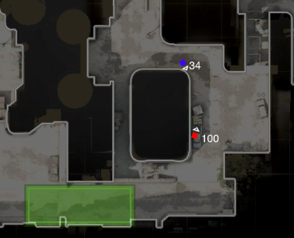

# csgo-radar

Simple radar cheat for popular shooter. Map images, among other things, are not included.

## How it works

1. The server starts a websocket server and attaches to the game's process. 
2. Using `ReadProcessMemory` it reads the EntityList from memory and sends relevant data to all subscribed clients.
3. The client(s) read the data and render the players positions, directions, and health values on top of the current map.

## Avoiding detection

To avoid VAC, the server component was initiated like so:
1. Compile [EmpireCOMPosh](https://gist.github.com/rhmoult/d77452ea70504fbb8635b4b2d17de6cb) by @subTee
  - This is because in the next step we use PowerShell which is [flagged by VAC](https://support.steampowered.com/kb_article.php?ref=2117-ilzv-2837)
2. Using the COM object registered in step 1, execute [Invoke-ReflectivePEInjection.ps1](https://github.com/PowerShellMafia/PowerSploit/blob/master/CodeExecution/Invoke-ReflectivePEInjection.ps1)
3. Reflectively inject our server component into `mbam.exe` (signed 32-bit Malwarebytes binary)

We assume that AV binaries are ignored by VAC heuristics. After all, it wouldn't be odd for `mbam.exe` to be reading process memory as that's just what it does :)
